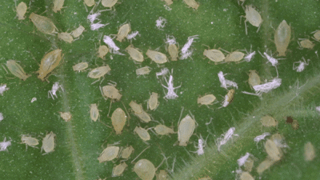
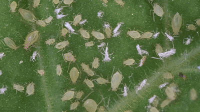

# Project Timeline

---

* **April 15, 2025:** Dataset and weight files made available on [Google Drive](YOUR_GOOGLE_DRIVE_LINK_HERE). (Note: We're actively optimizing the codebase.)
* **June 12, 2025:** Our paper was **officially accepted**!
* **July 7, 2025:** Paper **published**! Find it [here](YOUR_PUBLICATION_LINK_HERE).
* **July 16, 2025:** **RAMF code uploaded** to this repository.

---


<h2 align="center">
  High-Throughput End-to-End Aphid Honeydew Excretion Behavior Recognition Method Based on Rapid Adaptive Motion-Feature Fusion
</h2>

<div align="center">
  Zhongqiang Song<sup>1</sup>,
  Jiahao Shen<sup>1</sup>, 
  Qiaoyi Liu<sup>1</sup>, 
  Wanyue Zhang<sup>3</sup>, 
  Ziqian Ren<sup>1</sup>, 
  Kaiwen Yang<sup>1</sup>, 
  Xinle Li<sup>1</sup>, 
  Jialei Liu<sup>2</sup>, 
  Fengming Yan<sup>2</sup>, 
  Wenqiang Li<sup>1</sup>, 
  Yuqing Xing<sup>1</sup>, 
  Lili Wu<sup>1,*</sup>, 
</div>

<p align="center">
<i>
1. College of Science, Henan Agricultural University, Zhengzhou, Henan 450002, China &nbsp; 2. College of Plant Protection, Henan Agricultural University, Zhengzhou, Henan 450046, China &nbsp; 3. College of Computing, City University of Hong Kong, Hong Kong, 999077, China &nbsp;
</i>
</p>

## Read Paper：
https://www.frontiersin.org/journals/plant-science/articles/10.3389/fpls.2025.1609222/abstract

## Aphid Behavior Recognition Demo
### Effect Preview

| Origin                      | RAMF: Full Motion                         |
| :--------------------------: | :---------------------------------: |
|  | .gif) |
| **RAMF: Cross Motion**            | **Results**                   |
| _(No preview GIF)_       |  |

### Detailed Description and Links

*   **Origin:**
    *   [Watch on YouTube](https://www.youtube.com/watch?v=w-TXDCyeVK0)
    *   Original input video.
*   **Full Motion:**
    *   [Watch on YouTube](https://www.youtube.com/watch?v=U6TFHKn_7Y0)
    *   Run `Flow10.py` to generate the full motion version of the fused video for annotation data. Since the full motion version obscures Honeydew's optical properties, we use crossmotion to detect motion in odd frames and Honeydew in even frames.
*   **Cross Motion:**
    *   [Watch on YouTube](https://www.youtube.com/watch?v=ACB2qWA67pI)
    *   Run `Flow10%2.py` to generate the full motion version for detection task.The GIF animation cannot perfectly demonstrate the crossmotion effect, please click the YouTube link to view. No preview GIF for this stage.
*   **Results:**
    *   [Watch on YouTube](https://www.youtube.com/watch?v=KLuSV7d23nI)
    *   Because the crossmotion version alternates between motion frames and original frames, flickering occurs. We optimized the predictor and performed complete pre- and post-processing for RT-DETR, see the paper for details.


## 2. Quick start

### Setup
！python3.12.3
！PyTorch: 2.3.0+cu121
！torchvision: 0.18.0+cu121

```shell
conda create -n deim python=3.12.3
conda activate RAMF
pip install -r requirements.txt
```

### Weights
The weight files mentioned in the paper can be found at https://drive.google.com/drive/folders/1IWmjOV7a7ilVVY_DsyyO_hXcQOXaDpBI?usp=sharing
https://drive.google.com/drive/folders/1x6HPU3UU2AmzN1T9mhmMuSibFtoCTB2J?usp=sharing

### Aphid-Honeydew.1 Dataset
In the experiment, the first fine-grained aphid behavior dataset, encompassing crawling, flicking, and honeydew excretion behaviors, was constructed.If you wish to use this dataset, please cite our paper. The dataset can be referred to as **Aphid-Honeydew.1**.

The classes mapping table of the dataset downloaded from the network drive contains the following five categories:

*   kicking
*   move
*   HeadProbe
*   born
*   milu2

Category Mappings:

*   Category 0 "kicking" represents the behavior category "Flicking".
*   Category 1 "move" represents the behavior category "Crawling".
*   Category 4 "milu2" represents the category "Honeydew".


Our dataset can be found at https://drive.google.com/file/d/1uIJgNi4OcERA8spSsAdOIX-0BAINIZKS/view?usp=sharing

### Motion Feature
```shell
python flow10.py
python flow10%2.py
```
```shell
params：
startFrame = 0
TimeWindow = 10  # Size of Timewindow
batch_size = 256  # 
input_path = r'input_1-2.mp4' 
save_path = r'Honeydew'
process_video(input_path, save_path)
```
Use flow10.py to process all videos for generating datasets for annotation.

Use flow10%2.py for cross-frame processing of videos, where original frames and motion frames appear alternately. After processing, the video can be input for detection. (PS: When detecting aphids, we used cross-processing to detect Honeydew in the original frames; see the paper for specific details.)

### Train RT-DETR-RK50 Model
```shell
import warnings
warnings.filterwarnings('ignore')
from ultralytics import RTDETR

if __name__ == '__main__':
    model = RTDETR('ultralytics/cfg/models/rt-detr/rtdetr-rk50.yaml')
    # model.load('') # loading pretrain weights
    model.train(data='dataset\data.yaml',
                cache=True,
                imgsz=640,
                epochs=100,
                batch=4,
                workers=18,
                device='0',
                # resume='', # last.pt path
                project='runs/train',
                name='exp',
                )
```

### Val
```shell
import warnings
warnings.filterwarnings('ignore')
from ultralytics import RTDETR

if __name__ == '__main__':
    model = RTDETR('runs/train/exp83/weights/best.pt')
    model.val(data='dataset/data.yaml',
              split='val',
              imgsz=640,
              batch=1,
            #   save_json=True, # if you need to cal coco metrice
              project='runs/val',
              name='exp',
              )
```

### Replace predictor
```shell
Replace the original ultralytics\engine\predictor.py with predictor.py.
```

### Detect
```shell
python detect2.py
python detect3.py
python detect7-31.py
```
```shell
detect2：
TimeWindow = 10  
batch_size = 8  
model_path = "runs/train/exp4/weights/best.pt"
input_path = "/root/autodl-tmp/RTDETR-main/1920.mp4"
output_dir = "outputs"
```
```shell
detect3：
TimeWindow = 10  
batch_size = 8  
model_path = "runs/train/exp4/weights/best.pt"
input_path = "/root/autodl-tmp/RTDETR-main/1920.mp4" 
output_dir = "outputs"
```
```shell
detect7-31：
TimeWindow = 10    
batch_size = 24        
model_path = "runs/train/exp4/weights/best.pt"
input_path = "/root/autodl-tmp/RTDETR-main/1920.mp4" 
output_dir = "outputs"
```
We have three versions for inference: the first two, detect2 and detect3, are slower in processing speed, while detect7 is the final version and the fastest.

For trained models, run detect2.py directly for real-time end-to-end streaming inference.

For complete pre-processing and post-processing, you need to replace the predictor.py in the engine directory, then run detect3 for streaming inference.

Run detect7-31.py to achieve real-time streaming inference at 31 fps.

### RAMF：Rapid Adaptive Motion-Feature Fusion
.png)

### Stage-wise Honeydew Excreting Detection Pipeline and Results.


## Acknowledgement
Our work is built upon [RT-DETR](https://github.com/lyuwenyu/RT-DETR)、https://github.com/IvanDrokin/torch-conv-kan

✨ Feel free to contribute and reach out if you have any questions! ✨
